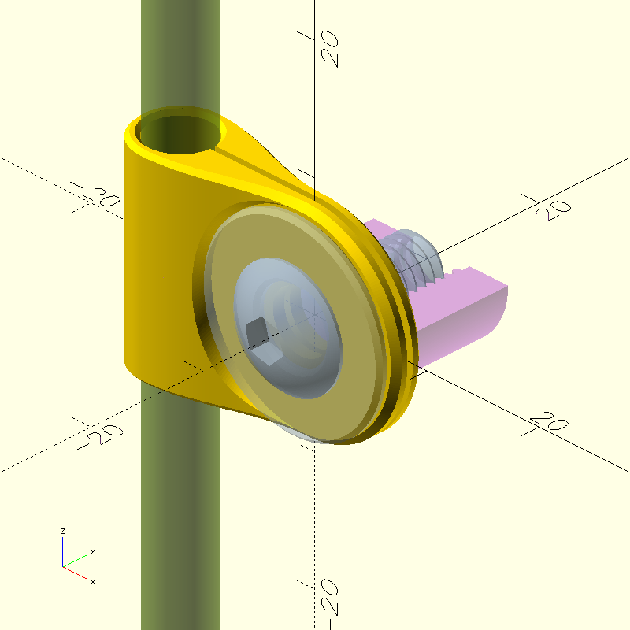
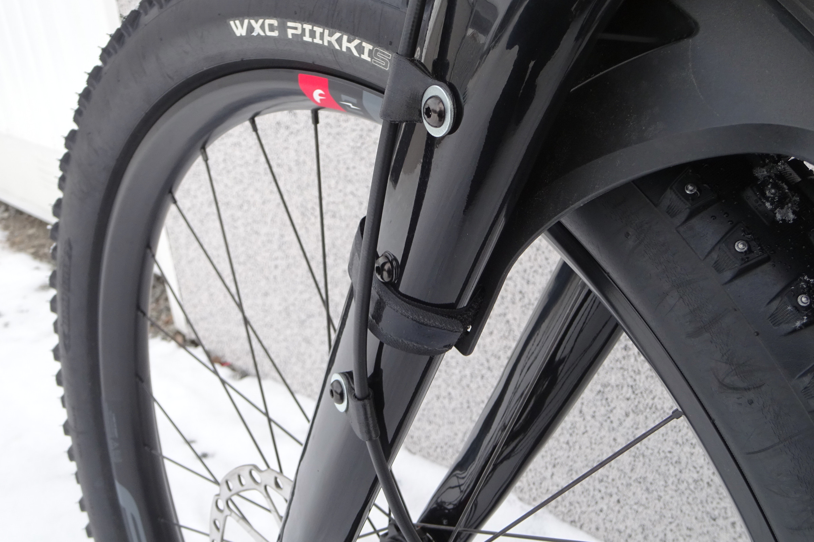
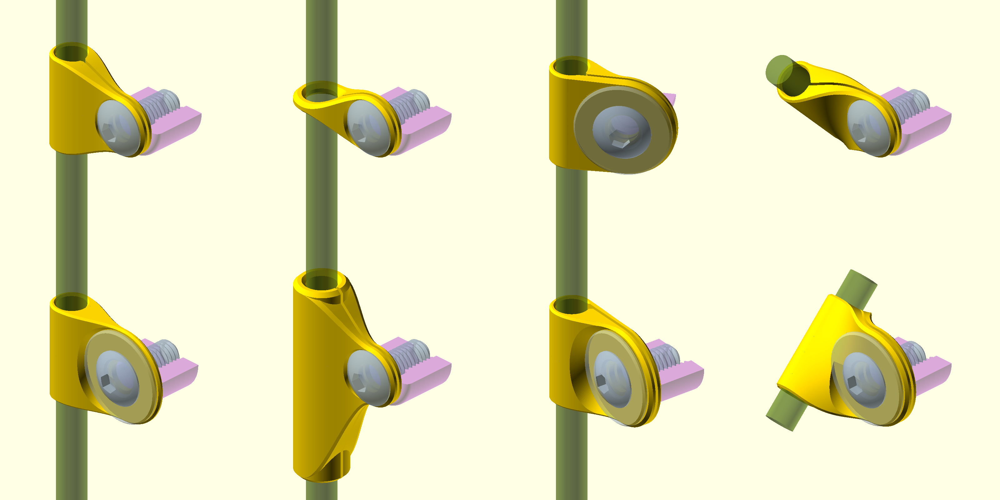

# Hose clamp

This OpenSCAD program creates a clamp
for attaching a brake hose to the fork of a bicycle.
However, the program is much more flexible than that.
With minimal changes, it can also be used to create a clamp
for attaching a shifter cable housing to the frame of a bicycle,
attaching an audio cable to a synthesizer or
attaching a garden hose to the wall.
It also serves as a practical demonstration
of building fully constrained models with filleting and rounding.

The default settings produce
a Tektro brake hose clamp for the Tandell PLUS29 Boost fork.
The fork in question has a channel down the left leg
for internal cable routing (at most 5 mm wide) and
three mounting bosses on each leg
for light cargo (at most 3 kg per side),
but has no other amenities for external cable routing or
mounting fenders, reflectors or lamps.
These clamps allow attaching a brake hose
to one or two of the bosses on the left leg,
so that swapping the fork does not require dismantling the brakes.

This project was created by Sampsa Kiiskinen on 2026-02-28 and
it is licensed under the GNU General Public License version 3 or later.
It is not intended to be developed any further,
but generalizations and derivative works are always welcome.
See the source code for details.

| File                 | Description
|:---------------------|:------------
| `README.md`          | Overview of the project (this file)
| `LICENSE`            | Copy of the project's license
| `clamp.scad`         | Source code of the parametric model
| `flexible-clamp.png` | Rendered image with default settings
| `flexible-clamp.stl` | Generated mesh with default settings
| `far.jpg`            | Photo of finished 3d prints
| `near.jpg`           | Close-up photo of finished 3d prints
| `clamps.png`         | Rendered montage with different settings
